  

# Awesome Korean Agent Skills

> A curated collection of Korean AI coding agent skills, agents, rules, and hooks — organized **by function**

> 🤖 **This repo is 100% maintained by AI agents.**
> Skill discovery, classification, addition, link validation, and weekly picks are all automated.
> Humans only supervise. [See how it works →](docs/how-it-works.en.md)

English | [한국어](README.md)

Korean-language skills scattered across many repos, gathered **by function** so you can compare them at a glance.
"I want to automate code reviews" → Go to the relevant category, check the tools and sources, and pick what works for you.

---

## What Are AI Agent Skills?

AI agent skills are **instruction files that teach AI coding assistants new capabilities**. Written in Markdown (`SKILL.md`), they are automatically loaded and used by the AI when needed.

**How they work:**
1. **Discover** — The AI checks available skill names and descriptions from the skill list
2. **Load** — When a relevant task is detected, it reads the full instructions
3. **Execute** — Performs the task according to the instructions

Beyond skills, there are various other forms, and this list classifies all of them by function:

| Icon | Type | Description |
|:---:|------|------|
| 🔧 | **Skill** | Task-specific instructions. Auto-loaded when a relevant task is detected |
| 🤖 | **Agent** | Expert persona. Invoked explicitly by the user |
| ⚡ | **Command** | Slash command. Executed directly by the user |
| 🪝 | **Hook** | Event trigger. Runs automatically under specific conditions |

> Note: See the Korean guide at [heilcheng/awesome-agent-skills](https://github.com/heilcheng/awesome-agent-skills) for more details.

---

## Tool Compatibility

The `SKILL.md` format is converging as a de facto industry standard. The same skill file can be shared across multiple tools.

| Tool | Code | Config Location | SKILL.md Compatible |
|------|:---:|-----------|:---:|
| Claude Code | CC | `.claude/skills/` | O |
| Gemini CLI | GC | `.gemini/skills/` | O |
| OpenAI Codex CLI | CX | `~/.codex/skills/` | O |
| GitHub Copilot | CP | `.github/skills/` | O |
| OpenCode | OC | `.opencode/skills/` | O |
| Cursor | CR | `.cursor/rules/` | X (proprietary format) |
| Windsurf | WS | `.windsurf/rules/` | △ |

---

## Source Types

| Source | Meaning |
|------|------|
| `Official` | Provided directly by the tool maker |
| `Partner` | Authorized or collaborative with the tool maker |
| `Community` | Created by individuals or teams |

## Language Labels

| Label | Meaning |
|------|------|
| `Korean` | Skill content is in Korean |
| `EN+KO` | English-based, with Korean README provided |
| `Multi(KO)` | Multi-language auto-detection, includes Korean |

---

## Skill of the Week

> Updated weekly. Curated by AI agents based on Korean support, active maintenance, and practicality. Last updated: 2026-06-01

| Skill | Tools | Why Recommended? | Link |
|------|:---:|---------|------|
| 📦 vibecoding | "혼자 공부하는 바이브코딩" 도서 공식 레포 | This is the official repository for the "VibeCoding" book, offering high practical value as a Korean learning resource. It's the only Korean content available in the Guides category. | [vibecoding](https://github.com/taehojo/vibecoding) |
| 🤖 nanobot |  | Nanobot, an ultra-lightweight personal AI agent, is a highly practical Agent type with diverse application potential. It stands out from other memory-related skills in the Collections category. | [nanobot](https://github.com/HKUDS/nanobot) |
| ⚡ next-ai-draw-io |  | This tool uses AI to generate and modify diagrams, proving useful for creating visual outputs. It's a Tool type in the Utilities category offering a unique functionality. | [next-ai-draw-io](https://github.com/DayuanJiang/next-ai-draw-io) |

---

## Development Skills

| Category | Description | Items |
|----------|------|:-------:|
| [Code Review](categories/code-review.md) | Code quality, security, maintainability review | 16+ |
| [Testing & TDD](categories/testing.md) | Test-driven development, E2E, coverage | 20+ |
| [Security Audit](categories/security.md) | OWASP, AWS Well-Architected, secret detection | 11+ |
| [Project Initialization](categories/project-init.md) | Framework scaffolding, spec & plan setup | 13+ |
| [Debugging & Build Errors](categories/debugging.md) | Root cause analysis, language-specific build resolvers | 8+ |
| [Documentation](categories/documentation.md) | Technical doc generation, Korean docs, code maps | 14+ |
| [Git & Workflow](categories/git-workflow.md) | Commits, PRs, worktrees, branching strategies | 16+ |
| [Refactoring & Code Cleanup](categories/refactoring.md) | Dead code removal, tech debt, simplification | 7+ |
| [Multi-Agent Orchestration](categories/multi-agent.md) | Parallel & sequential agent coordination automation | 24+ |
| [AI & Prompt Engineering](categories/ai-prompt.md) | Prompt optimization, cross-model collaboration, self-learning | 9+ |
| [Web Frontend](categories/web-frontend.md) | React, Next.js, Tailwind, UI/UX | 16+ |
| [Backend](categories/backend.md) | NestJS, FastAPI, API design, DB | 6+ |
| [Performance Optimization](categories/performance.md) | Profiling, caching, bundle size | 6+ |
| [Game Development](categories/game-dev.md) | Unity, Blender, C# | 5+ |
| [DevOps & Deployment](categories/devops.md) | CI/CD, releases, monitoring, session management | 17+ |

## Daily & Productivity Skills

| Category | Description | Items |
|----------|------|:-------:|
| [Korean Life Services](categories/korean-services.md) | SRT/KTX, parcel tracking, lotto, KBO, KakaoTalk | 7+ |
| [Communication](categories/communication.md) | Email & Slack triage, notification settings | 3+ |
| [Content & Marketing](categories/content-marketing.md) | Card news, design prompts, image generation | 4+ |
| [Writing & Korean Language](categories/korean-writing.md) | AI style transfer, spell checking, technical docs | 5+ |
| [Media](categories/media.md) | YouTube subtitles, image processing | 2+ |
| [Office & Documents](categories/office-docs.md) | Word, Excel, PPT, PDF, HWP | 6+ |
| [Research & Web](categories/research-web.md) | Web search, scraping, Markdown conversion | 10+ |

## Comprehensive Repos

| Category | Description |
|----------|------|
| [Frameworks (All-in-One)](categories/frameworks.md) | Install once to set up agents, skills, and hooks all at once |
| [Comprehensive Skill Collections](categories/collections.md) | Skills from multiple domains gathered in a single repo |
| [Guides & Tutorials](categories/guides.md) | Skill usage guides, Claude Code guides, learning resources |
| [Utility Tools](categories/utilities.md) | Rule conversion & management tools, Korean language support tools |

---

## 🤖 Automation

This repo is automatically maintained by GitHub Actions-based AI agents.

| Workflow | Schedule | Role |
|---|---|---|
| skill-scout | Weekly | Discover · classify · add new skills |
| link-checker | Daily | Detect · remove dead links |
| weekly-picks | Weekly | Rotate "Skill of the Week" |
| sync-counts | Daily | Sync item counts · date |

See [here](docs/how-it-works.en.md) for detailed operation principles.

---

## Contributing

Please read [contributing.md](contributing.md). Let's build the Korean AI coding skill ecosystem together!

If you discover a new skill, open a PR. For category suggestions, open an Issue.
