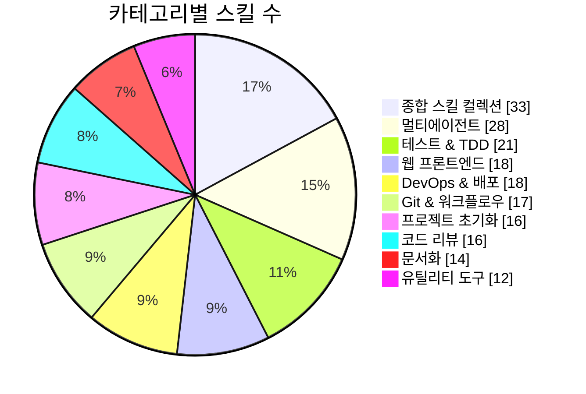
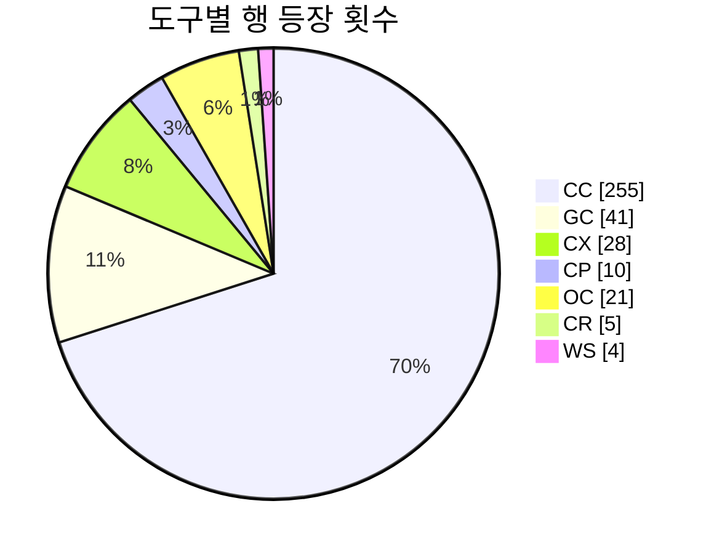
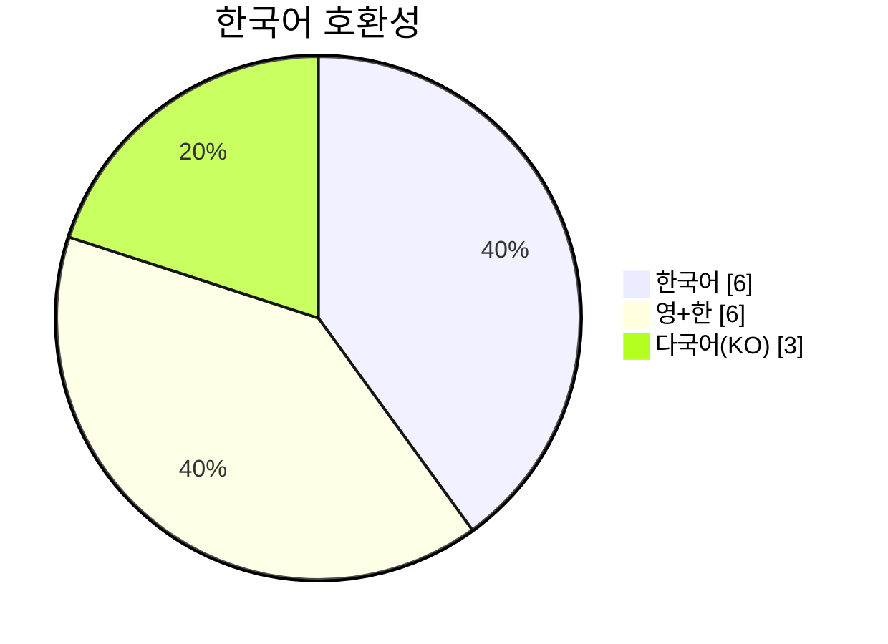

<p align="center">
  
</p>

# Awesome Korean Agent Skills

[](https://awesome.re)
[](LICENSE)
[](contributing.md)
[](docs/how-it-works.md)

> 한국어 AI 코딩 에이전트 스킬 · 에이전트 · 룰 · 훅을 **기능별**로 모은 큐레이션

> 🤖 **이 레포는 100% AI 에이전트가 자동으로 운영합니다.**
> 스킬 발견 · 분류 · 추가 · 링크 검증 · 주간 추천까지 모두 자동화되어 있습니다.
> 사람은 감독만 합니다. [어떻게 돌아가는지 보기 →](docs/how-it-works.md)

[English](README.en.md)

여러 레포에 흩어진 한국어 스킬을 **같은 기능끼리** 모아서 한눈에 비교할 수 있습니다.
"코드 리뷰 자동화하고 싶다" → 해당 카테고리로 가서 도구와 출처를 보고 골라 쓰세요.

---

## 이 주의 스킬

> 매주 업데이트됩니다. 한국어 지원 · 활발한 유지보수 · 실용성을 기준으로 관리자가 선정합니다. 최근 업데이트: 2026-06-12

| 스킬 | 도구 | 왜 추천? | 링크 |
|------|:---:|---------|------|
| 🔧 claude-mem | CC/GC | claude-mem은 세션 간 지속적인 에이전트 메모리 압축 기능을 제공하여 에이전트의 성능과 효율성을 높이는 데 실용적입니다. 'collections' 카테고리에서 한국어 지원이 잘 될 것으로 기대됩니다. | [claude-mem](https://github.com/thedotmack/claude-mem) |
| 🔧 cursor-rules | CX | cursor-rules는 다양한 언어 및 프레임워크에 대한 Cursor 규칙 모음을 제공하여 개발 생산성을 향상시키는 데 유용합니다. 'frameworks' 카테고리에서 실용성이 높습니다. | [cursor-rules](https://github.com/flyeric0212/cursor-rules) |
| 🤖 opencode |  | opencode는 오픈소스 AI 코딩 에이전트로, 다양한 개발자들이 협업하고 코딩 효율성을 높이는 데 기여할 수 있습니다. 'utilities' 카테고리에서 실용적이고 다양한 타입(🤖 Agent)을 혼합하는 데 적합합니다. | [opencode](https://github.com/anomalyco/opencode) |

---

## 개발 스킬

| 카테고리 | 설명 | 항목 수 |
|----------|------|:-------:|
| [코드 리뷰](categories/code-review.md) | 코드 품질, 보안, 유지보수성 검토 | 16+ |
| [테스트 & TDD](categories/testing.md) | 테스트 주도 개발, E2E, 커버리지 | 21+ |
| [보안 감사](categories/security.md) | OWASP, AWS Well-Architected, 시크릿 탐지 | 11+ |
| [프로젝트 초기화](categories/project-init.md) | 프레임워크별 스캐폴딩, 명세·계획 수립 | 16+ |
| [디버깅 & 빌드 에러](categories/debugging.md) | 루트 원인 분석, 언어별 빌드 리졸버 | 8+ |
| [문서화](categories/documentation.md) | 기술 문서 생성, 한국어 문서, 코드맵 | 14+ |
| [Git & 워크플로우](categories/git-workflow.md) | 커밋, PR, 워크트리, 브랜칭 전략 | 17+ |
| [리팩토링 & 코드 정리](categories/refactoring.md) | 데드 코드 제거, 기술 부채, 간소화 | 7+ |
| [멀티에이전트 오케스트레이션](categories/multi-agent.md) | 병렬·순차 에이전트 조율 자동화 | 28+ |
| [AI & 프롬프트 엔지니어링](categories/ai-prompt.md) | 프롬프트 최적화, 모델 간 협업, 자기 학습 | 10+ |
| [웹 프론트엔드](categories/web-frontend.md) | React, Next.js, Tailwind, UI/UX | 18+ |
| [백엔드](categories/backend.md) | NestJS, FastAPI, API 설계, DB | 6+ |
| [성능 최적화](categories/performance.md) | 프로파일링, 캐싱, 번들 크기 | 6+ |
| [게임 개발](categories/game-dev.md) | Unity, Blender, C# | 5+ |
| [DevOps & 배포](categories/devops.md) | CI/CD, 릴리즈, 모니터링, 세션 관리 | 18+ |

## 일상 · 업무 스킬

| 카테고리 | 설명 | 항목 수 |
|----------|------|:-------:|
| [한국 생활 서비스](categories/korean-services.md) | SRT/KTX, 택배, 로또, KBO, 카카오톡 | 7+ |
| [커뮤니케이션](categories/communication.md) | 이메일·슬랙 트리아지, 알림 설정 | 3+ |
| [콘텐츠 & 미디어](categories/content-media.md) | 카드뉴스, 이미지 생성, 유튜브 자막 | 11+ |
| [글쓰기 & 한국어](categories/korean-writing.md) | AI 문체 변환, 맞춤법 교정, 기술 문서 | 6+ |
| [오피스 & 문서](categories/office-docs.md) | Word, Excel, PPT, PDF, HWP | 6+ |
| [리서치 & 웹](categories/research-web.md) | 웹 검색, 스크래핑, 마크다운 변환 | 10+ |

## 종합 레포

| 카테고리 | 설명 |
|----------|------|
| [프레임워크 (올인원)](categories/frameworks.md) | 설치하면 에이전트·스킬·훅이 한꺼번에 세팅 |
| [종합 스킬 컬렉션](categories/collections.md) | 여러 분야의 스킬을 한 레포에 모아놓은 것 |
| [가이드 & 튜토리얼](categories/guides.md) | 스킬 활용법, Claude Code 가이드, 학습 자료 |
| [유틸리티 도구](categories/utilities.md) | 룰 변환·관리 도구, 한국어 지원 도구 |

---

## 빠른 설치

자주 쓰이는 스킬 컬렉션을 한 줄로 설치할 수 있습니다:

```bash
# Claude Code — bear2u/my-skills (한국어 스킬 21개)
git clone https://github.com/bear2u/my-skills.git /tmp/my-skills && cp -r /tmp/my-skills/.claude/skills/* ~/.claude/skills/ && rm -rf /tmp/my-skills

# Claude Code — NomaDamas/k-skill (한국 생활 서비스 15개)
git clone https://github.com/NomaDamas/k-skill.git /tmp/k-skill && cp -r /tmp/k-skill/skills/* ~/.claude/skills/ && rm -rf /tmp/k-skill

# Claude Code — oh-my-claudecode (올인원 프레임워크)
npx oh-my-claudecode@latest init

# Claude Code — claude-forge (올인원 프레임워크)
npx claude-forge@latest init

# Gemini CLI — oh-my-gemini-cli
npx oh-my-gemini-cli@latest init
```

> 각 레포의 설치 방법이 다를 수 있으니, 링크를 클릭해서 공식 설치 가이드를 확인하세요.

---

<details>
<summary><strong>범례 · 도구 호환성 · 용어 설명</strong> (클릭하여 펼치기)</summary>

### AI 에이전트 스킬이란?

AI 에이전트 스킬은 **AI 코딩 어시스턴트에게 새로운 능력을 가르치는 지침 파일**입니다. 마크다운(`SKILL.md`)으로 작성하며, AI가 필요할 때 자동으로 불러와서 사용합니다.

**작동 방식:**
1. **탐색** — AI가 사용 가능한 스킬 목록에서 이름과 설명을 확인
2. **로드** — 관련 작업을 감지하면 전체 지침을 읽어옴
3. **실행** — 지침에 따라 작업 수행

스킬 외에도 다양한 형태가 있으며, 이 목록은 이 모든 것을 기능 기준으로 분류합니다:

| 표기 | 유형 | 설명 |
|:---:|------|------|
| 🔧 | **Skill** | 특정 작업 지침서. 관련 작업 감지 시 자동 로드 |
| 🤖 | **Agent** | 전문가 페르소나. 명시적으로 호출하여 사용 |
| ⚡ | **Command** | 슬래시 명령. 사용자가 직접 실행 |
| 🪝 | **Hook** | 이벤트 트리거. 특정 조건에서 자동 실행 |

> 참고: [heilcheng/awesome-agent-skills](https://github.com/heilcheng/awesome-agent-skills)의 한국어 가이드에서 더 자세한 설명을 볼 수 있습니다.

### 도구별 호환성

`SKILL.md` 포맷이 사실상 업계 표준으로 수렴 중입니다. 같은 스킬 파일을 여러 도구에서 공유할 수 있습니다.

| 도구 | 코드 | 설정 위치 | SKILL.md 호환 |
|------|:---:|-----------|:---:|
| Claude Code | CC | `.claude/skills/` | O |
| Gemini CLI | GC | `.gemini/skills/` | O |
| OpenAI Codex CLI | CX | `~/.codex/skills/` | O |
| GitHub Copilot | CP | `.github/skills/` | O |
| OpenCode | OC | `.opencode/skills/` | O |
| Cursor | CR | `.cursor/rules/` | X (독자 포맷) |
| Windsurf | WS | `.windsurf/rules/` | △ |

### 언어 표기

| 표기 | 의미 |
|------|------|
| `한국어` | 스킬 본문이 한국어 |
| `영+한` | 영어 기반, 한국어 README 제공 |
| `다국어(KO)` | 다국어 자동 감지, 한국어 포함 |

공식 스킬에는 `공식` 표기가 붙어 있습니다.

</details>

---

<!-- STATS:START — auto-generated by .github/scripts/generate-stats.sh -->

## 📊 통계 한눈에

<sub>마지막 갱신: 2026-06-12 · 자동 생성 · 데이터는 [categories/](categories/) 표에서 직접 카운트</sub>

<table>
<tr align="center">
<td>📦 <b>총 스킬·에이전트</b><br/><sub>카테고리 표 행 합산</sub></td>
<td>🗂️ <b>등록 레포</b><br/><sub>known-repos.json</sub></td>
<td>🏷️ <b>활성 카테고리</b><br/><sub>categories/*.md</sub></td>
</tr>
<tr align="center">
<td><h2>307+</h2></td>
<td><h2>674</h2></td>
<td><h2>25</h2></td>
</tr>
</table>

### 카테고리별 분포 (Top 10)



### 도구별 호환성 등장 빈도



### 언어 분포



<!-- STATS:END -->

---

<!-- DIGEST:START — auto-generated by .github/scripts/generate-digest.sh -->

## 🤖 최근 자동화 활동

<sub>지난 7일 (since 2026-06-05T00:00:00Z UTC) · 자동 생성 · 마지막 갱신 2026-06-12</sub>

<table>
<tr align="center">
<td>🔍 <b>skill-scout</b><br/><sub>신규 스킬 발견</sub></td>
<td>🔗 <b>link-checker</b><br/><sub>죽은 링크 제거</sub></td>
<td>📊 <b>sync-counts</b><br/><sub>카운트·통계 갱신</sub></td>
<td>⭐ <b>weekly-picks</b><br/><sub>이 주의 스킬</sub></td>
</tr>
<tr align="center">
<td><b>19</b> run · <b>+22</b> 스킬</td>
<td><b>8</b> run · <b>-0</b> dead link</td>
<td><b>15</b> run</td>
<td><b>1</b> run</td>
</tr>
</table>

### 일자별 활동 (최근 7일)

| 날짜 | 🔍 신규 | 🔗 정리 | 📊 동기화 | ⭐ 추천 |
|------|:---:|:---:|:---:|:---:|
| 2026-06-06 | **2** | **1** | **2** | · |
| 2026-06-07 | **1** | **1** | **2** | · |
| 2026-06-08 | **4** | **1** | **2** | **1** |
| 2026-06-09 | **3** | **1** | **2** | · |
| 2026-06-10 | **2** | **1** | **2** | · |
| 2026-06-11 | **3** | **1** | **2** | · |
| 2026-06-12 | **2** | **1** | **1** | · |

<sub>전체 PR 이력: [Actions](https://github.com/J-nowcow/awesome-korean-agent-skills/actions)</sub>

<!-- DIGEST:END -->

---

## 최근 업데이트

| 날짜 | 내용 |
|------|------|
| 2026-04-01 | 첫 릴리즈! 26개 카테고리, 400+ 스킬/에이전트 수록 |

> 전체 변경 이력은 [CHANGELOG.md](CHANGELOG.md)를 참고하세요.

---

## 🤖 자동화

이 레포는 GitHub Actions 기반 AI 에이전트가 자동으로 운영합니다.

| 워크플로우 | 주기 | 역할 |
|---|---|---|
| skill-scout | 주 1회 | 신규 스킬 발견 · 분류 · 추가 |
| link-checker | 매일 | 죽은 링크 감지 · 제거 |
| weekly-picks | 주 1회 | "이 주의 스킬" 로테이션 |
| sync-counts | 매일 | 항목 수 · 날짜 동기화 |

자세한 동작 원리는 [여기](docs/how-it-works.md)에서 확인하세요.

---

## 기여하기

[contributing.md](contributing.md)를 읽어주세요. 한국어 AI 코딩 스킬 생태계를 함께 만들어갑시다!

새로운 스킬을 발견하면 PR을, 카테고리 제안은 Issue를 열어주세요.
