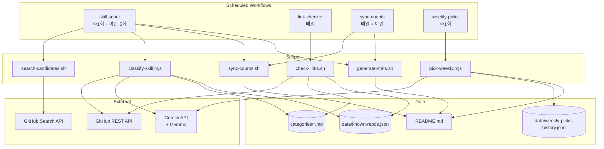
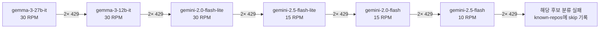

# 🏗️ Architecture

> awesome-korean-agent-skills의 내부 구조 — 데이터 파일, 워크플로 체인, 외부 의존성을 다이어그램으로 정리.
>
> [← 메인으로](../README.md) · [어떻게 돌아가나 →](how-it-works.md)

---

## 전체 시스템



---

## skill-scout 흐름 (가장 복잡)

```mermaid
flowchart LR
    A[cron 트리거] --> B[search-candidates.sh]
    B --> B1{쿼리 풀<br/>30개}
    B1 -->|UTC hour % 4| B2[8개 라운드로빈 선택]
    B2 --> B3[gh search repos<br/>SEARCH_TOKEN]
    B3 --> B4{필터<br/>archived/stars≥2<br/>updated<6m}
    B4 --> B5[known-repos<br/>중복 제거]
    B5 --> B6[stars 내림차순<br/>cap 40개]
    B6 --> C{후보 있음?}
    C -->|0개| END[종료]
    C -->|≥1| D[classify-skill.mjs]
    D --> D1[README + SKILL.md<br/>가져오기]
    D1 --> D2[Gemini/Gemma<br/>6단 fallback]
    D2 --> D3{한국어 +<br/>카테고리?}
    D3 -->|YES| D4[categories/*.md<br/>표 행 추가]
    D3 -->|NO| D5[known-repos에<br/>skip 기록]
    D4 --> E[Sync README counts + stats]
    D5 --> E
    E --> F[브랜치 생성<br/>force-with-lease push]
    F --> G[PR 생성<br/>auto-merge]
    G --> H[main 머지]
```



### 6단 모델 fallback 체인

`classify-skill.mjs`의 모델 순서. 각 모델별 free tier quota가 독립이므로 한 모델이 rate-limit 막혀도 다음 모델로 자동 전환. 회로차단기로 2회 연속 429 시 영구 skip.



---

## 데이터 파일 책임 분리

| 파일 | 책임 | 갱신 주체 |
|------|------|-----------|
| `categories/*.md` | 사용자에게 보여줄 큐레이션 표 | classify-skill / check-links |
| `data/known-repos.json` | 처리·발견 이력 (재처리 방지) | classify-skill / check-links |
| `data/weekly-picks-history.json` | 과거 weekly-picks 추천 이력 | pick-weekly |
| `README.md` (STATS 블록) | mermaid 통계 + 카테고리 항목 수 | sync-counts + generate-stats |
| `README.md` (이 주의 스킬) | weekly-picks 결과 | pick-weekly |

각 워크플로는 자기 책임 파일만 수정하므로 PR 충돌이 거의 발생하지 않는다.

---

## 트리거 타임라인 (UTC)

```mermaid
gantt
    title 하루치 워크플로 실행 (UTC 기준)
    dateFormat HH:mm
    axisFormat %H:%M

    section Daily
    link-checker          :05:00, 30m
    sync-counts (메인)    :06:00, 15m

    section 야간 누적 (Weekday + Weekend)
    skill-scout #1 (그룹3) :15:00, 30m
    skill-scout #2 (그룹0) :16:00, 30m
    skill-scout #3 (그룹1) :17:00, 30m
    skill-scout #4 (그룹2) :18:00, 30m
    skill-scout #5 (그룹3) :19:00, 30m
    sync-counts (야간)    :19:30, 15m

    section Monday
    skill-scout (정기)    :03:00, 30m
    weekly-picks          :04:00, 30m
```



UTC 15-19시 = **KST 자정~새벽 4시**. 사용자가 자는 동안 5회 누적 실행.

---

## 외부 의존성

| 서비스 | 용도 | 인증 |
|--------|------|------|
| GitHub Search API | 후보 레포 발견 | `secrets.SEARCH_TOKEN` (fine-grained PAT) |
| GitHub REST API | README/SKILL.md 가져오기, PR/Issue 생성 | `secrets.GITHUB_TOKEN` (workflow auto) |
| Google Gemini API | 한국어 판별 + 카테고리 분류 + 추천 사유 | `secrets.GEMINI_API_KEY` |

### 왜 PAT 두 개?

`secrets.GITHUB_TOKEN`은 cross-org public repo search에서 결과가 빈약하게 반환되는 알려진 제약이 있다. PAT(`SEARCH_TOKEN`) 도입 후 동일 쿼리에서 30개 후보 발견 → 0개에서 정상화.

`GITHUB_TOKEN`은 우리 레포 쓰기 권한을 가지고 있어 PR·머지·이슈 생성 단계에서 사용.

---

## 안정성 패턴

### Stale branch 처리

auto/* 브랜치는 throwaway. 이전 실패 run이 남긴 동명 브랜치가 origin에 있으면 push가 non-fast-forward로 reject. 모든 push 단계에 사전 정리 + `--force-with-lease` 적용.

```bash
git push origin --delete "$BRANCH" 2>/dev/null || true
git checkout -b "$BRANCH"
git commit -m "..."
git push --force-with-lease origin "$BRANCH"
```

### 회로차단기

`classify-skill.mjs`의 `dead_models` Set. 한 모델이 같은 run에서 2회 연속 429 받으면 즉시 다음 모델로 전환. 죽은 모델에 후보마다 ~6분 낭비하는 패턴 차단.

### YAML run-block indent

`run: |` 블록 안의 multiline `--body "..."`이 column 1부터 시작하면 YAML 파서가 블록 종료로 오인. echo 블록 + `--body-file` 패턴으로 회피.

---

## Self-Healing

- **죽은 링크** → link-checker가 매일 제거
- **카운트 불일치** → sync-counts가 매일 갱신
- **새 스킬 누락** → skill-scout 야간 5회 + 정기 1회로 매주 발견
- **모델 quota 고갈** → 6단 fallback + 회로차단기
- **stale 브랜치** → 모든 push가 사전 정리

사람의 개입이 필요한 경우:

- 카테고리 신규 정의
- 잘못된 분류 PR close
- 외부 API 인증 갱신
