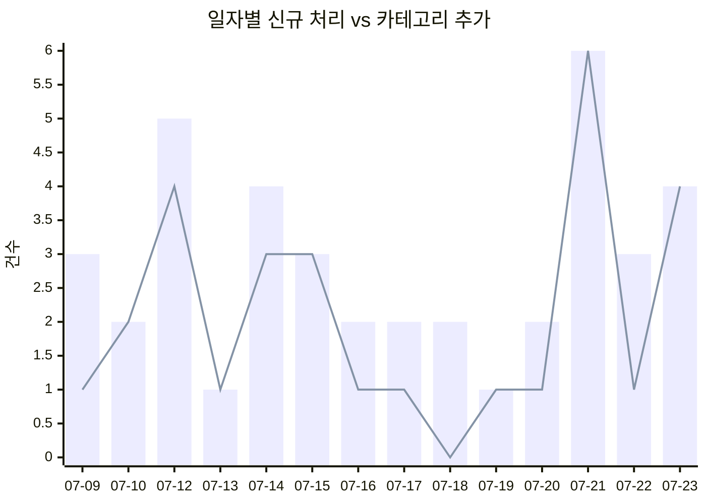
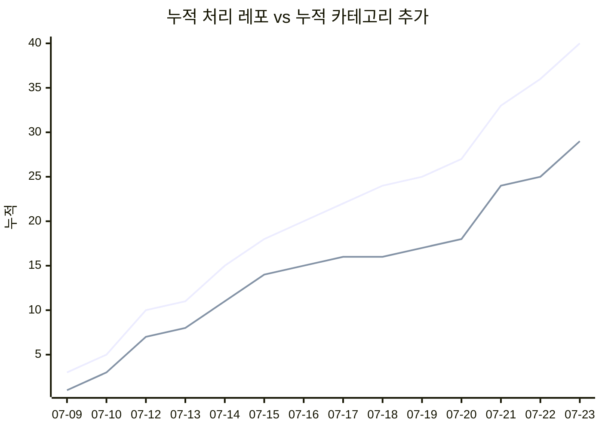

# 📈 Trends

> known-repos.json의 `last_scanned` 기준 일자별 처리 추이. **자동 생성** — 직접 수정 금지.
>
> [← 메인으로](../README.md) · [Architecture →](architecture.md)

---

## 한눈에

<table>
<tr align="center">
<td>📅 <b>운영 기간</b></td>
<td>📦 <b>총 처리 레포</b></td>
<td>✅ <b>카테고리 추가</b></td>
<td>📊 <b>활성 일수</b></td>
</tr>
<tr align="center">
<td>2026-04-10 → 2026-07-23</td>
<td><h2>775</h2></td>
<td><h2>194</h2></td>
<td><h2>71</h2></td>
</tr>
</table>

마지막 갱신: 2026-07-24

---

## 일자별 처리 추이

> bar: 일일 신규 처리(검색·분류 시도), line: 카테고리에 실제 추가된 건수

---

## 최근 14일 상세

| 날짜 | 처리(시도) | 카테고리 추가 | 채택률 |
|------|---:|---:|---:|
| 2026-07-09 | 3 | 1 | 33% |
| 2026-07-10 | 2 | 2 | 100% |
| 2026-07-12 | 5 | 4 | 80% |
| 2026-07-13 | 1 | 1 | 100% |
| 2026-07-14 | 4 | 3 | 75% |
| 2026-07-15 | 3 | 3 | 100% |
| 2026-07-16 | 2 | 1 | 50% |
| 2026-07-17 | 2 | 1 | 50% |
| 2026-07-18 | 2 | 0 | 0% |
| 2026-07-19 | 1 | 1 | 100% |
| 2026-07-20 | 2 | 1 | 50% |
| 2026-07-21 | 6 | 6 | 100% |
| 2026-07-22 | 3 | 1 | 33% |
| 2026-07-23 | 4 | 4 | 100% |

---

## 누적 라인업

---

## 채택률 (운영 전체)

검색·분류 시도한 775개 중 **194개**가 한국어 호환 + 카테고리 매칭으로 채택됐다. **채택률: 25.0%**

나머지는 비한국어 / 카테고리 불일치 / 분류 실패 등으로 known-repos에 skip 기록만 남는다.
