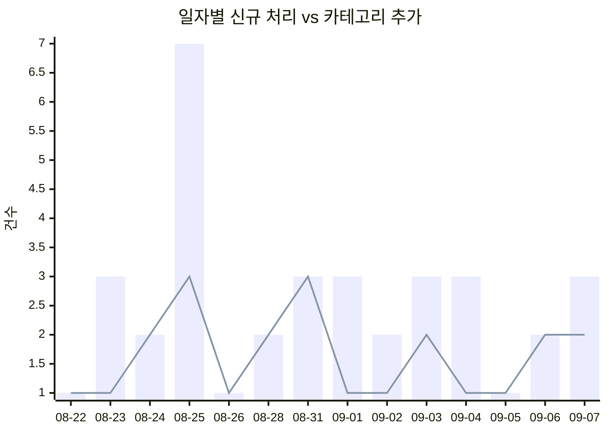
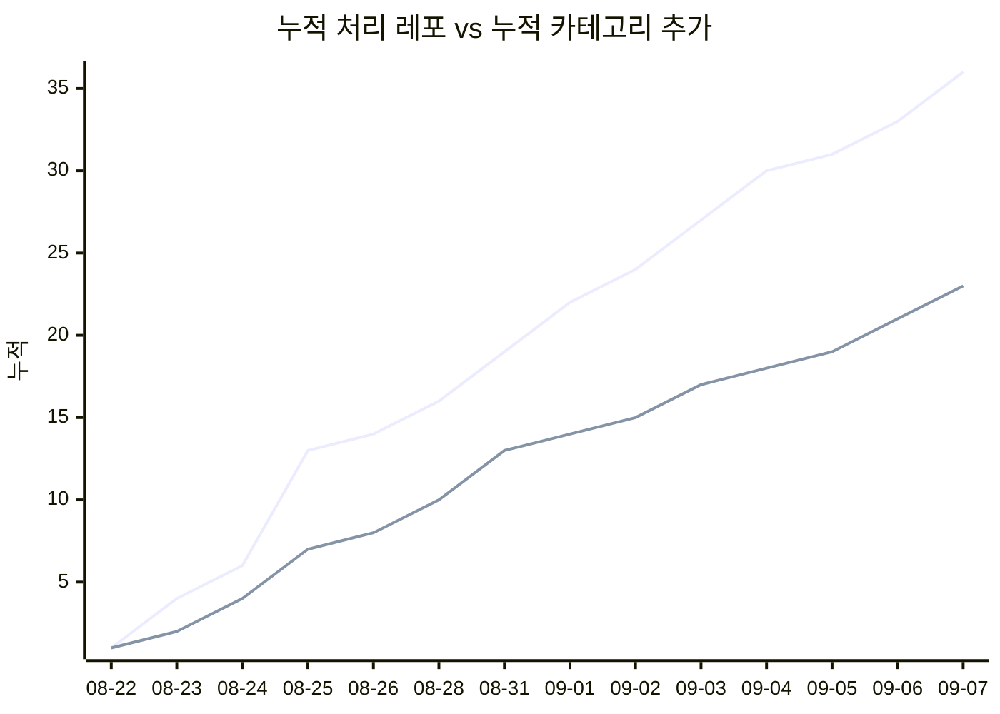

# 📈 Trends

> known-repos.json의 `last_scanned` 기준 일자별 처리 추이. **자동 생성** — 직접 수정 금지.
>
> [← 메인으로](../README.md) · [Architecture →](architecture.md)

---

## 한눈에

<table>
<tr align="center">
<td>📅 <b>운영 기간</b></td>
<td>📦 <b>총 처리 레포</b></td>
<td>✅ <b>카테고리 추가</b></td>
<td>📊 <b>활성 일수</b></td>
</tr>
<tr align="center">
<td>2026-04-10 → 2026-09-07</td>
<td><h2>869</h2></td>
<td><h2>259</h2></td>
<td><h2>110</h2></td>
</tr>
</table>

마지막 갱신: 2026-09-07

---

## 일자별 처리 추이

```mermaid
xychart-beta
    title "일자별 신규 처리 vs 카테고리 추가"
    x-axis ["08-22","08-23","08-24","08-25","08-26","08-28","08-31","09-01","09-02","09-03","09-04","09-05","09-06","09-07"]
    y-axis "건수"
    bar [1,3,2,7,1,2,3,3,2,3,3,1,2,3]
    line [1,1,2,3,1,2,3,1,1,2,1,1,2,2]
```

> bar: 일일 신규 처리(검색·분류 시도), line: 카테고리에 실제 추가된 건수

---

## 최근 14일 상세

| 날짜 | 처리(시도) | 카테고리 추가 | 채택률 |
|------|---:|---:|---:|
| 2026-08-22 | 1 | 1 | 100% |
| 2026-08-23 | 3 | 1 | 33% |
| 2026-08-24 | 2 | 2 | 100% |
| 2026-08-25 | 7 | 3 | 43% |
| 2026-08-26 | 1 | 1 | 100% |
| 2026-08-28 | 2 | 2 | 100% |
| 2026-08-31 | 3 | 3 | 100% |
| 2026-09-01 | 3 | 1 | 33% |
| 2026-09-02 | 2 | 1 | 50% |
| 2026-09-03 | 3 | 2 | 67% |
| 2026-09-04 | 3 | 1 | 33% |
| 2026-09-05 | 1 | 1 | 100% |
| 2026-09-06 | 2 | 2 | 100% |
| 2026-09-07 | 3 | 2 | 67% |

---

## 누적 라인업

```mermaid
xychart-beta
    title "누적 처리 레포 vs 누적 카테고리 추가"
    x-axis ["08-22","08-23","08-24","08-25","08-26","08-28","08-31","09-01","09-02","09-03","09-04","09-05","09-06","09-07"]
    y-axis "누적"
    line [1,4,6,13,14,16,19,22,24,27,30,31,33,36]
    line [1,2,4,7,8,10,13,14,15,17,18,19,21,23]
```

---

## 채택률 (운영 전체)

검색·분류 시도한 869개 중 **259개**가 한국어 호환 + 카테고리 매칭으로 채택됐다. **채택률: 29.8%**

나머지는 비한국어 / 카테고리 불일치 / 분류 실패 등으로 known-repos에 skip 기록만 남는다.
