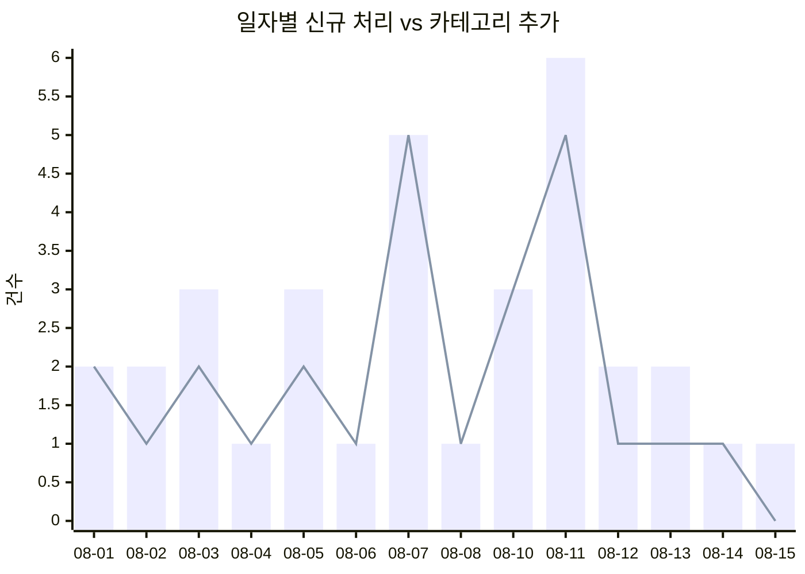
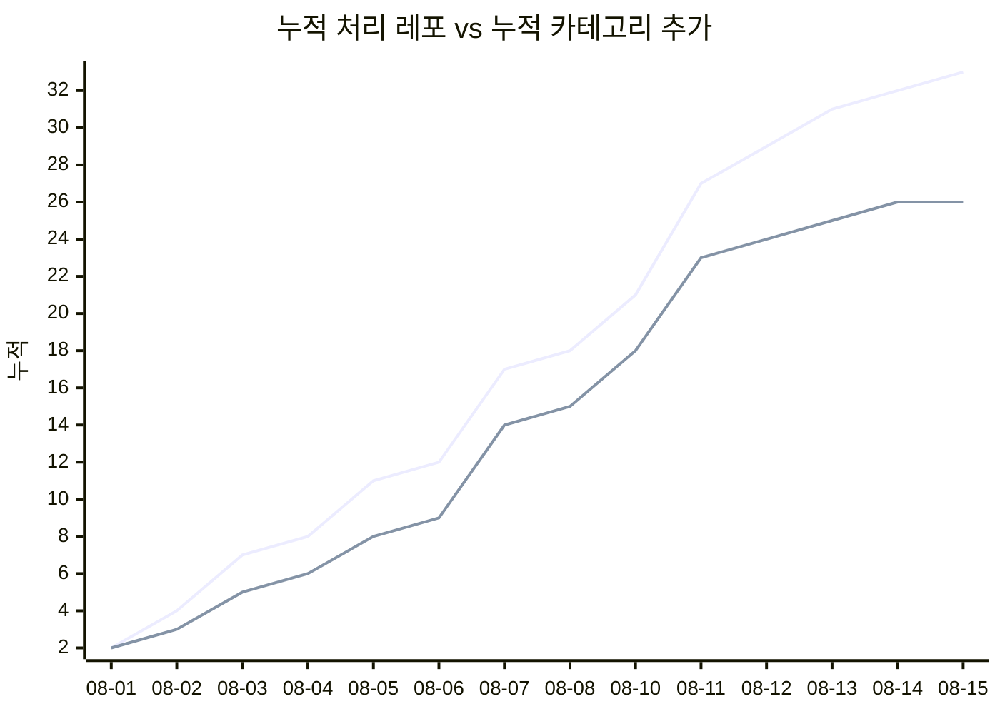

# 📈 Trends

> known-repos.json의 `last_scanned` 기준 일자별 처리 추이. **자동 생성** — 직접 수정 금지.
>
> [← 메인으로](../README.md) · [Architecture →](architecture.md)

---

## 한눈에

<table>
<tr align="center">
<td>📅 <b>운영 기간</b></td>
<td>📦 <b>총 처리 레포</b></td>
<td>✅ <b>카테고리 추가</b></td>
<td>📊 <b>활성 일수</b></td>
</tr>
<tr align="center">
<td>2026-04-10 → 2026-08-15</td>
<td><h2>824</h2></td>
<td><h2>230</h2></td>
<td><h2>92</h2></td>
</tr>
</table>

마지막 갱신: 2026-08-16

---

## 일자별 처리 추이

```mermaid
xychart-beta
    title "일자별 신규 처리 vs 카테고리 추가"
    x-axis ["08-01","08-02","08-03","08-04","08-05","08-06","08-07","08-08","08-10","08-11","08-12","08-13","08-14","08-15"]
    y-axis "건수"
    bar [2,2,3,1,3,1,5,1,3,6,2,2,1,1]
    line [2,1,2,1,2,1,5,1,3,5,1,1,1,0]
```

> bar: 일일 신규 처리(검색·분류 시도), line: 카테고리에 실제 추가된 건수

---

## 최근 14일 상세

| 날짜 | 처리(시도) | 카테고리 추가 | 채택률 |
|------|---:|---:|---:|
| 2026-08-01 | 2 | 2 | 100% |
| 2026-08-02 | 2 | 1 | 50% |
| 2026-08-03 | 3 | 2 | 67% |
| 2026-08-04 | 1 | 1 | 100% |
| 2026-08-05 | 3 | 2 | 67% |
| 2026-08-06 | 1 | 1 | 100% |
| 2026-08-07 | 5 | 5 | 100% |
| 2026-08-08 | 1 | 1 | 100% |
| 2026-08-10 | 3 | 3 | 100% |
| 2026-08-11 | 6 | 5 | 83% |
| 2026-08-12 | 2 | 1 | 50% |
| 2026-08-13 | 2 | 1 | 50% |
| 2026-08-14 | 1 | 1 | 100% |
| 2026-08-15 | 1 | 0 | 0% |

---

## 누적 라인업

```mermaid
xychart-beta
    title "누적 처리 레포 vs 누적 카테고리 추가"
    x-axis ["08-01","08-02","08-03","08-04","08-05","08-06","08-07","08-08","08-10","08-11","08-12","08-13","08-14","08-15"]
    y-axis "누적"
    line [2,4,7,8,11,12,17,18,21,27,29,31,32,33]
    line [2,3,5,6,8,9,14,15,18,23,24,25,26,26]
```

---

## 채택률 (운영 전체)

검색·분류 시도한 824개 중 **230개**가 한국어 호환 + 카테고리 매칭으로 채택됐다. **채택률: 27.9%**

나머지는 비한국어 / 카테고리 불일치 / 분류 실패 등으로 known-repos에 skip 기록만 남는다.
