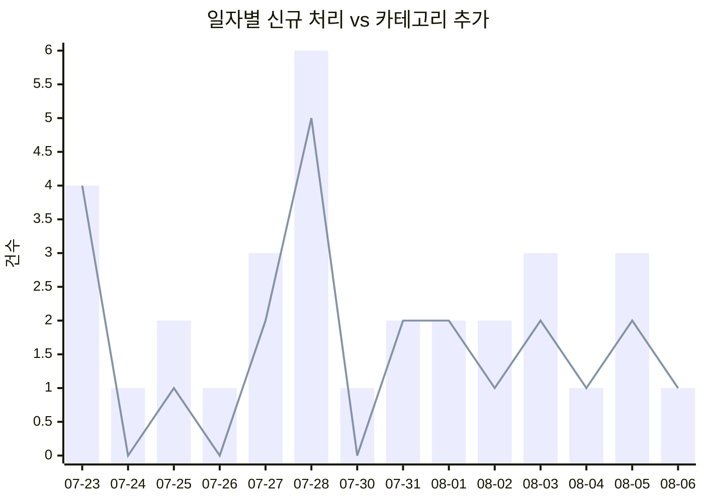
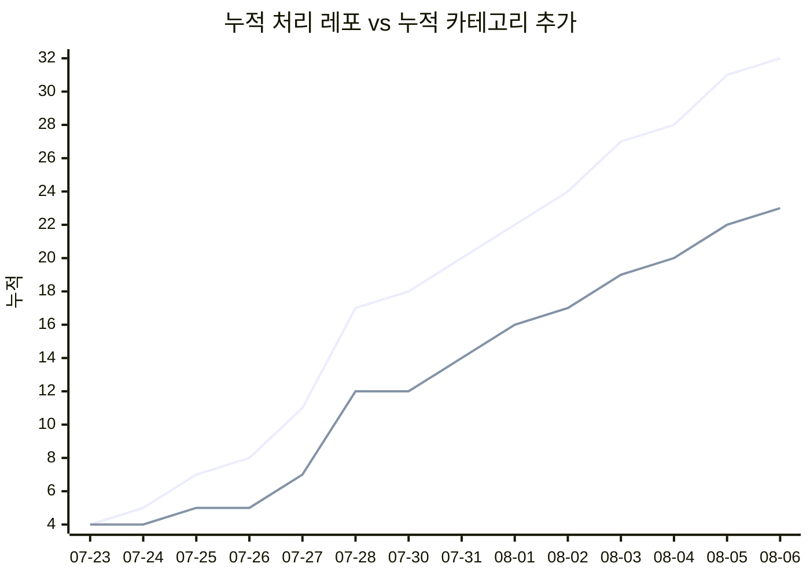

# 📈 Trends

> known-repos.json의 `last_scanned` 기준 일자별 처리 추이. **자동 생성** — 직접 수정 금지.
>
> [← 메인으로](../README.md) · [Architecture →](architecture.md)

---

## 한눈에

<table>
<tr align="center">
<td>📅 <b>운영 기간</b></td>
<td>📦 <b>총 처리 레포</b></td>
<td>✅ <b>카테고리 추가</b></td>
<td>📊 <b>활성 일수</b></td>
</tr>
<tr align="center">
<td>2026-04-10 → 2026-08-06</td>
<td><h2>803</h2></td>
<td><h2>213</h2></td>
<td><h2>84</h2></td>
</tr>
</table>

마지막 갱신: 2026-08-06

---

## 일자별 처리 추이

```mermaid
xychart-beta
    title "일자별 신규 처리 vs 카테고리 추가"
    x-axis ["07-23","07-24","07-25","07-26","07-27","07-28","07-30","07-31","08-01","08-02","08-03","08-04","08-05","08-06"]
    y-axis "건수"
    bar [4,1,2,1,3,6,1,2,2,2,3,1,3,1]
    line [4,0,1,0,2,5,0,2,2,1,2,1,2,1]
```

> bar: 일일 신규 처리(검색·분류 시도), line: 카테고리에 실제 추가된 건수

---

## 최근 14일 상세

| 날짜 | 처리(시도) | 카테고리 추가 | 채택률 |
|------|---:|---:|---:|
| 2026-07-23 | 4 | 4 | 100% |
| 2026-07-24 | 1 | 0 | 0% |
| 2026-07-25 | 2 | 1 | 50% |
| 2026-07-26 | 1 | 0 | 0% |
| 2026-07-27 | 3 | 2 | 67% |
| 2026-07-28 | 6 | 5 | 83% |
| 2026-07-30 | 1 | 0 | 0% |
| 2026-07-31 | 2 | 2 | 100% |
| 2026-08-01 | 2 | 2 | 100% |
| 2026-08-02 | 2 | 1 | 50% |
| 2026-08-03 | 3 | 2 | 67% |
| 2026-08-04 | 1 | 1 | 100% |
| 2026-08-05 | 3 | 2 | 67% |
| 2026-08-06 | 1 | 1 | 100% |

---

## 누적 라인업

```mermaid
xychart-beta
    title "누적 처리 레포 vs 누적 카테고리 추가"
    x-axis ["07-23","07-24","07-25","07-26","07-27","07-28","07-30","07-31","08-01","08-02","08-03","08-04","08-05","08-06"]
    y-axis "누적"
    line [4,5,7,8,11,17,18,20,22,24,27,28,31,32]
    line [4,4,5,5,7,12,12,14,16,17,19,20,22,23]
```

---

## 채택률 (운영 전체)

검색·분류 시도한 803개 중 **213개**가 한국어 호환 + 카테고리 매칭으로 채택됐다. **채택률: 26.5%**

나머지는 비한국어 / 카테고리 불일치 / 분류 실패 등으로 known-repos에 skip 기록만 남는다.
