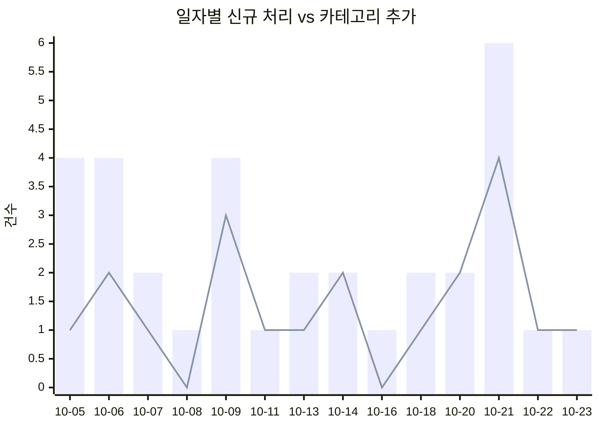
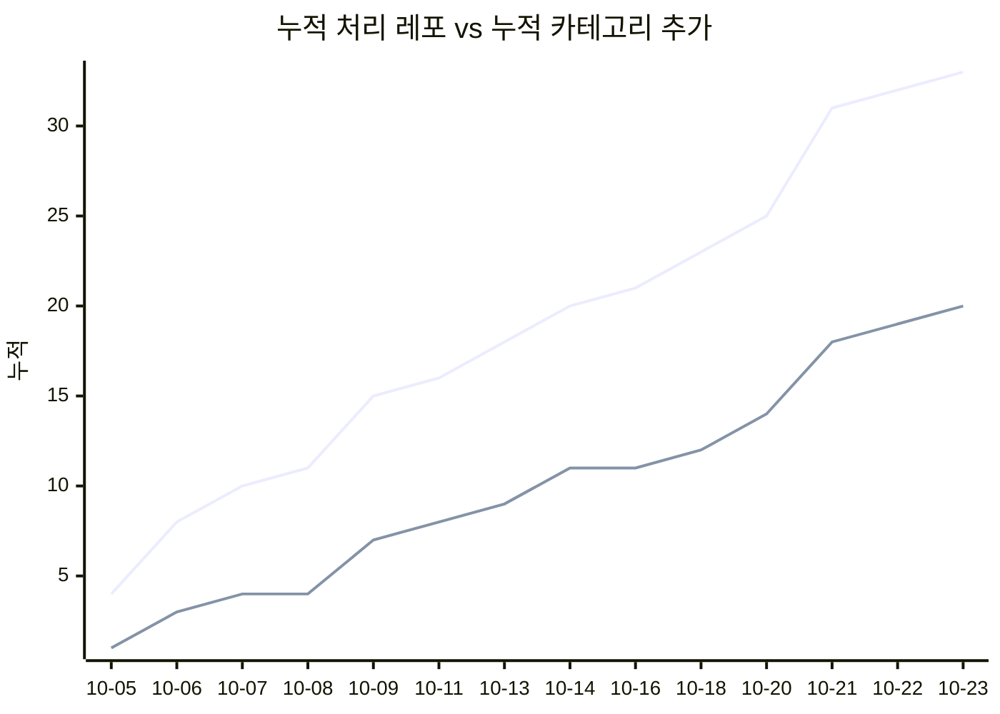

# 📈 Trends

> known-repos.json의 `last_scanned` 기준 일자별 처리 추이. **자동 생성** — 직접 수정 금지.
>
> [← 메인으로](../README.md) · [Architecture →](architecture.md)

---

## 한눈에

<table>
<tr align="center">
<td>📅 <b>운영 기간</b></td>
<td>📦 <b>총 처리 레포</b></td>
<td>✅ <b>카테고리 추가</b></td>
<td>📊 <b>활성 일수</b></td>
</tr>
<tr align="center">
<td>2026-04-10 → 2026-10-23</td>
<td><h2>948</h2></td>
<td><h2>308</h2></td>
<td><h2>144</h2></td>
</tr>
</table>

마지막 갱신: 2026-10-23

---

## 일자별 처리 추이

```mermaid
xychart-beta
    title "일자별 신규 처리 vs 카테고리 추가"
    x-axis ["10-05","10-06","10-07","10-08","10-09","10-11","10-13","10-14","10-16","10-18","10-20","10-21","10-22","10-23"]
    y-axis "건수"
    bar [4,4,2,1,4,1,2,2,1,2,2,6,1,1]
    line [1,2,1,0,3,1,1,2,0,1,2,4,1,1]
```

> bar: 일일 신규 처리(검색·분류 시도), line: 카테고리에 실제 추가된 건수

---

## 최근 14일 상세

| 날짜 | 처리(시도) | 카테고리 추가 | 채택률 |
|------|---:|---:|---:|
| 2026-10-05 | 4 | 1 | 25% |
| 2026-10-06 | 4 | 2 | 50% |
| 2026-10-07 | 2 | 1 | 50% |
| 2026-10-08 | 1 | 0 | 0% |
| 2026-10-09 | 4 | 3 | 75% |
| 2026-10-11 | 1 | 1 | 100% |
| 2026-10-13 | 2 | 1 | 50% |
| 2026-10-14 | 2 | 2 | 100% |
| 2026-10-16 | 1 | 0 | 0% |
| 2026-10-18 | 2 | 1 | 50% |
| 2026-10-20 | 2 | 2 | 100% |
| 2026-10-21 | 6 | 4 | 67% |
| 2026-10-22 | 1 | 1 | 100% |
| 2026-10-23 | 1 | 1 | 100% |

---

## 누적 라인업

```mermaid
xychart-beta
    title "누적 처리 레포 vs 누적 카테고리 추가"
    x-axis ["10-05","10-06","10-07","10-08","10-09","10-11","10-13","10-14","10-16","10-18","10-20","10-21","10-22","10-23"]
    y-axis "누적"
    line [4,8,10,11,15,16,18,20,21,23,25,31,32,33]
    line [1,3,4,4,7,8,9,11,11,12,14,18,19,20]
```

---

## 채택률 (운영 전체)

검색·분류 시도한 948개 중 **308개**가 한국어 호환 + 카테고리 매칭으로 채택됐다. **채택률: 32.5%**

나머지는 비한국어 / 카테고리 불일치 / 분류 실패 등으로 known-repos에 skip 기록만 남는다.
